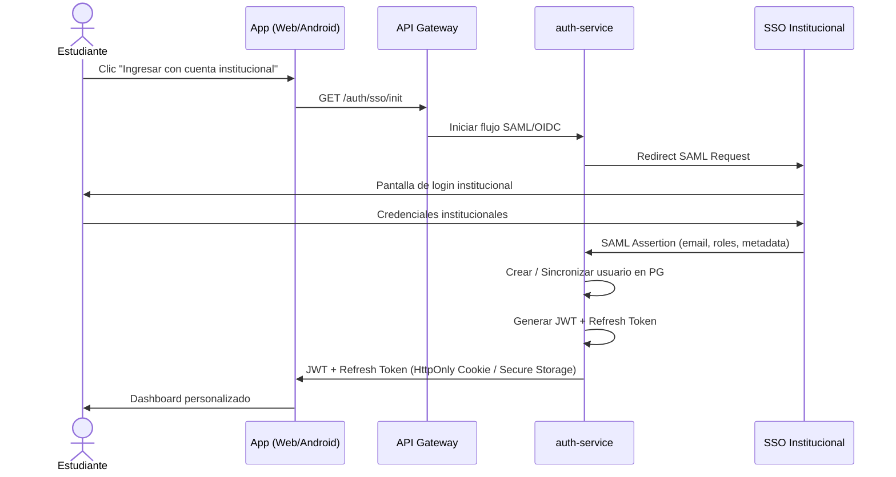
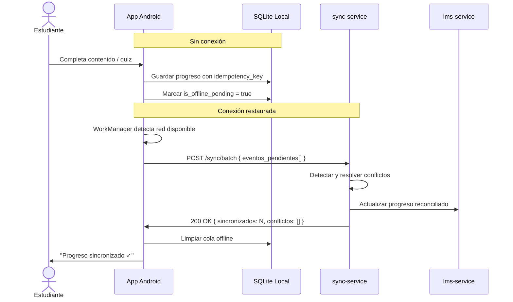

# Universidad X — Arquitectura del Sistema

## Diagrama de Arquitectura (Mermaid)

```mermaid
graph TB
    subgraph CLIENTS["Clientes"]
        WEB["🌐 Next.js Web App\n(Mobile-First · SSR · PWA)"]
        AND["📱 Android App\n(Kotlin Native · Offline-First)"]
    end

    subgraph EDGE["Edge & Acceso"]
        CDN["CDN — CloudFront / GCP CDN\nVideos HLS · Assets Estáticos\nDescargas Offline"]
        APIGW["API Gateway — Kong / AWS APIGW\nRate Limiting · JWT Validation\nRouting · CORS · Logging"]
    end

    subgraph SERVICES["Microservicios — Kubernetes (GKE / EKS)"]
        AUTH["auth-service\nJWT + Refresh Tokens\nSSO SAML 2.0 / OIDC\nTokens Biométricos"]
        LMS["lms-service\nCursos · Módulos · Contenido\nDrip Release · Quizzes"]
        SYNC["sync-service\nReconciliación Offline\nMerge de Conflictos\nIdempotency Keys"]
        NOTIF["notification-service\nFCM Push · Email\nSMS · Scheduling"]
        HELPDESK["helpdesk-service\nTickets · Chat en Vivo\nChatbot con IA (RAG)"]
        CREDS["credentials-service\nBadges · Certificados\nEmisión Blockchain"]
        AI["ai-service\nPerfil de Aprendizaje\nRutas Adaptativas\nAnálisis de Desempeño"]
        MEDIA["media-service\nUpload · Transcoding HLS\nSubtítulos Automáticos"]
    end

    subgraph DBS["Capa de Datos"]
        PG[("PostgreSQL\nUsers · Courses · Modules\nEnrollments · Tickets\nBadges · Live Sessions")]
        MONGO[("MongoDB\nPerfil IA por Estudiante\nLogs de Actividad\nOffline Sync Queue")]
        REDIS[("Redis\nCache de Sesiones\nQueues — BullMQ\nLeaderboards")]
    end

    subgraph EXTERNAL["Servicios de Terceros"]
        SSO_EXT["SSO Institucional\n(SAML 2.0 / OpenID Connect)"]
        BLOCKCHAIN_EXT["Blockchain\n(Polygon / Hyperledger Fabric)\nCertificados Verificables On-Chain"]
        CREDLY_EXT["Credly / Acreditta\nOpen Badges 3.0\nPortabilidad Laboral"]
        AI_EXT["OpenAI / Claude API\nChatbot + RAG Administrativo\nIA Adaptativa"]
        FCM_EXT["Firebase Cloud Messaging\nPush Notifications Android"]
        ZOOM_EXT["Zoom / BigBlueButton\nSesiones Síncronas En Vivo"]
    end

    AND -- "HTTPS / WebSocket" --> APIGW
    WEB -- "HTTPS / WebSocket" --> APIGW
    WEB -- "Assets Estáticos" --> CDN
    AND -- "Descargas Offline (Wi-Fi)" --> CDN

    APIGW --> AUTH
    APIGW --> LMS
    APIGW --> SYNC
    APIGW --> NOTIF
    APIGW --> HELPDESK
    APIGW --> CREDS
    APIGW --> AI
    APIGW --> MEDIA

    AUTH --> PG
    AUTH --> REDIS
    AUTH -. "Federar Identidad" .-> SSO_EXT

    LMS --> PG
    LMS --> REDIS
    LMS -. "Sesiones Live" .-> ZOOM_EXT

    SYNC --> MONGO
    SYNC --> PG
    SYNC --> REDIS

    NOTIF --> REDIS
    NOTIF -. "Push Android" .-> FCM_EXT

    HELPDESK --> PG
    HELPDESK -. "LLM + RAG" .-> AI_EXT

    CREDS --> PG
    CREDS -. "Mint Token" .-> BLOCKCHAIN_EXT
    CREDS -. "Open Badges" .-> CREDLY_EXT

    AI --> MONGO
    AI -. "Inferencia LLM" .-> AI_EXT

    MEDIA --> CDN
```

## Descripción de Capas

| Capa | Tecnología | Responsabilidad |
|------|-----------|----------------|
| **Web Frontend** | Next.js 14 + TypeScript + Tailwind | SSR, PWA, accesibilidad WCAG 2.1 |
| **Android** | Kotlin + Jetpack Compose + WorkManager | Offline-first, biometría, sincronización |
| **API Gateway** | Kong + AWS API Gateway | Seguridad perimetral, throttling, routing |
| **CDN** | CloudFront / GCP CDN | Entrega de video HLS, assets, descargas |
| **auth-service** | Node.js + Passport.js | JWT, SSO, tokens biométricos |
| **lms-service** | Node.js / FastAPI | Lógica principal del LMS |
| **sync-service** | Node.js | Reconciliación de progreso offline |
| **ai-service** | Python FastAPI | Perfil adaptativo, recomendaciones |
| **media-service** | Node.js + FFmpeg | Transcoding, streaming HLS |
| **PostgreSQL** | RDS / Cloud SQL | Datos relacionales transaccionales |
| **MongoDB** | Atlas | Perfiles IA, logs, cola de sincronización |
| **Redis** | ElastiCache | Caché, colas BullMQ, sesiones |

## Flujo de Autenticación SSO

## Flujo de Sincronización Offline

